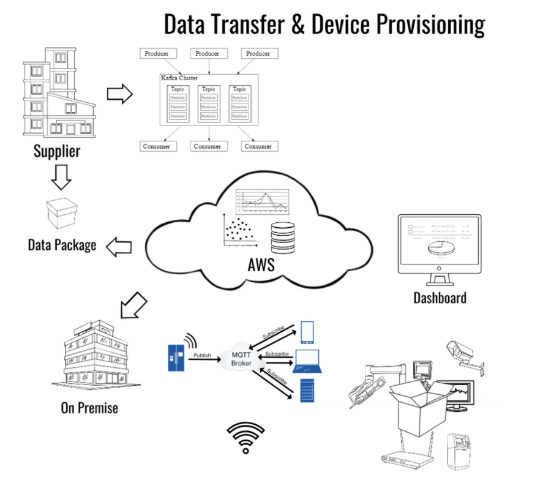

# mhp-mobility-hackathon-2022-big

## Introduction
Firmware has many uses and areas that it supports throughout processes, specifically in manufacturing, sales,
and aftersales. To provision these IoT devices, data must be transferred to the manufacturing execution system
first. However, firmware for these IoT devices was created by other development departments. This leads to
numerous devices, with the constant need for firmware updates. These updates are done approximately once a
month. Upon completion, the development department must inform their partner system via a Kafka interface
for downloading the firmware files. These files must then be stored on the AWS Cloud, before being transformed
into a predefined format for provisioning the IoT decides. This data is then transferred to an on-premises system.
Following this step, the data provisions the IoT devices via an MQTT interface.

Your challenge is to optimise the firmware transfer and provisioning process by creating an automatic firmware
update for large numbers of devices. With multiple stages throughout, data must be provisioned by many service
units, to many service units. Can you find a solution to minimise the complexity and increase efficiency? The new
system should provide a dashboard overview of the transfer status, showing the data package and provisioning
status of the IoT devices being displayed. Create a working demonstration of your solution for gathering, transforming and storing data to provision numerous IoT devices.

## Scope
The MHP challenge expert team will play the role as firmware supplier at the hackathon and will deliver endpoints to download different types of firmware data files. Beside that,the MHP challenge expert team will inform all the hackathon dev teams about the new firmware update by publishing a notification in a kafka-cluster.

The hackathon dev team should:

1. subscribe a kafka-topic and receive kafka-notifications
2. process download of different types of firmware data files and storage those files in the AWS Cloud
3. rebuild a on-premise-service to poll the current information about the firmware update
4. download data files from AWS cloud to on-premise-service and inform the IoT devices via MQTT about a new update
5. simulate / connect multiple IoT devices to retrieve those firmware update files from on-premise-service "over the air"
6. monitor the whole workflow via a daschboard

## Data Structure

